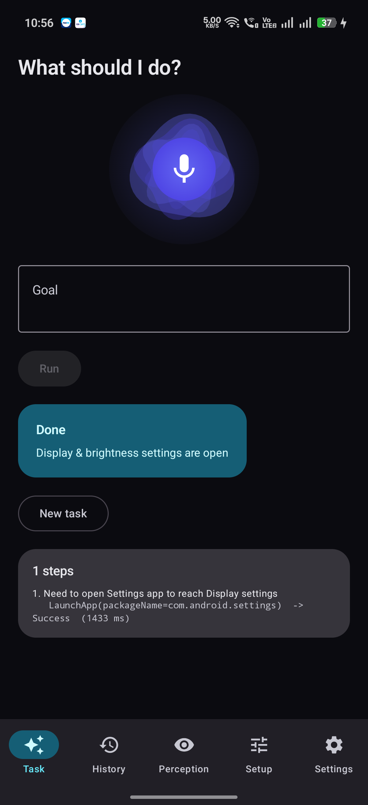
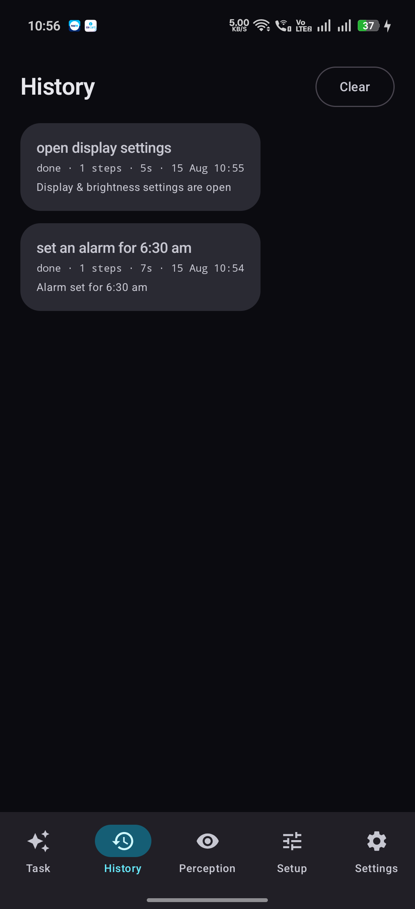
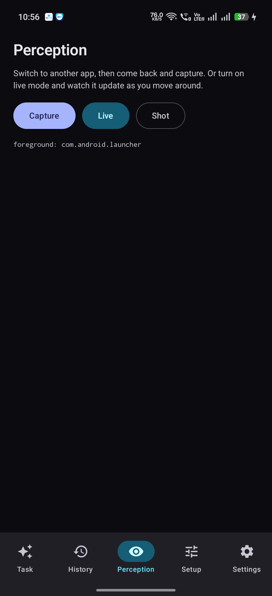
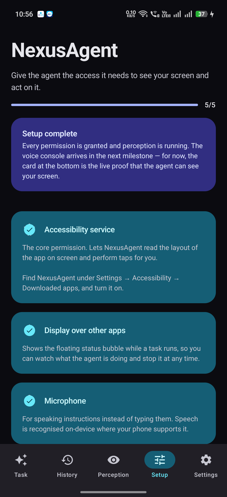
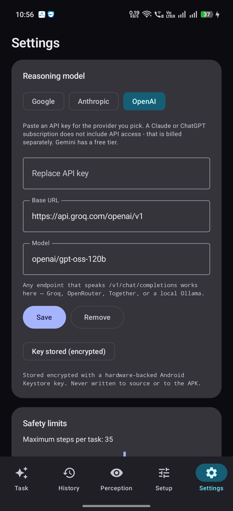

# NexusAgent

> An autonomous OS-level UI agent for Android. Speak a goal — the phone drives itself.

```
"Set an alarm for 6:30am"    →  agent fires the Clock Intent, no UI opened
"Turn on aeroplane mode"     →  agent opens Settings, finds the row, taps it
"Open Chrome and search X"   →  agent launches Chrome, types, submits
```

NexusAgent works on **any** app — WhatsApp, Instagram, MakeMyTrip, Settings — with **zero
per-app integration**. There is no WhatsApp SDK and no Instagram API. The agent reads the
screen through the Android accessibility framework the way a screen reader does, decides
what a human would tap next, and taps it.

---

## The app

| Task console | History | Perception |
|---|---|---|
|  |  |  |
| Speak or type a goal. The orb is amplitude-reactive while listening and keeps moving through *Thinking* and *Acting*, so a multi-second model call never looks like a hang. | Every run recorded step by step, with the aggregate compression metric computed across all of them. | Live view of what the agent sees — the compressed payload and the measured reduction for the app behind this one. |

| Setup | Settings |
|---|---|
|  |  |
| Permission wizard. Accessibility and overlay are unusual permissions, and a raw system dialog with no explanation reads as malware — so each one says what it is for before sending you to Settings. OEM-specific steps (autostart, battery exemption) appear only on manufacturers that need them. | Provider, endpoint, and model are all user-configurable. The key is encrypted with a hardware-backed Keystore key and never written to source or the APK. |

---

## How it works

```
┌────────────────────────────────────────────────────────────┐
│   PERCEIVE ──► COMPRESS ──► REASON ──► ACT ──► VERIFY ──┐  │
│      ▲                                                  │  │
│      └──────────────────────────────────────────────────┘  │
└────────────────────────────────────────────────────────────┘
```

| Stage | What happens |
|---|---|
| **Perceive** | Walk the live `AccessibilityNodeInfo` tree of the foreground app |
| **Compress** | Prune non-interactive containers, hoist their text, emit compact JSON |
| **Reason** | Send goal + history + screen to an LLM; get back one `{thought, action}` |
| **Act** | Perform a node action, dispatch a raw gesture, or fire an Intent |
| **Verify** | Wait for the screen to settle, re-observe, confirm something changed |

One iteration is a **step**. A task is 3–12 steps, hard-capped at 25 with loop detection,
oscillation detection, and a wall-clock budget — a non-deterministic agent holding gesture
privileges needs hard limits far more than a normal app does.

---

## Measured compression

Real screens, real apps, on a physical OPPO CPH2761 running Android 16. Every figure is
produced by the running app and logged under `NexusMetrics` — none are estimates.

| App | Nodes | Payload | Reduction | Walk |
|---|---:|---:|---:|---:|
| WhatsApp | 191 → 40 | 65,709 B → 3,677 B | **94.4%** | 388 ms |
| Instagram | 121 → 30 | 61,464 B → 2,427 B | **96.1%** | 222 ms |
| Chrome | 133 → 27 | 44,737 B → 3,048 B | 93.2% | 247 ms |
| Settings | 81 → 17 | 24,452 B → 1,450 B | 94.1% | 163 ms |
| Launcher | 74 → 39 | 51,725 B → 2,772 B | 94.6% | 221 ms |

Two honest caveats:

- **The launcher only sheds 47% of its nodes**, versus ~79% elsewhere. That is correct
  behaviour, not a weak result: a home screen is almost entirely app icons, and every icon
  *is* a legitimate tap target. There is little structural scaffolding to discard.
- **Walk times include the baseline measurement**, which serializes the unpruned tree
  purely so the reduction can be reported. The agent loop runs with it off.

Reproduce any row:

```powershell
adb shell am broadcast -a com.nexusagent.CAPTURE `
  -f 0x00000020 -n com.nexusagent.debug/com.nexusagent.debug.DebugCaptureReceiver
adb logcat -s NexusMetrics
```

The **History** tab aggregates the same numbers across every recorded step, so the claim
is backed by accumulated data rather than one capture.

---

## Status — all milestones verified on device

| Milestone | State |
|---|---|
| M1 perception | ✅ service online, foreground app tracked |
| M2 compression | ✅ ~94% payload reduction across five real apps |
| M3 execution | ✅ click / scroll / type / back / Intent verified |
| M4 reasoning | ✅ structured output selects correct elements |
| M5 orchestrator | ✅ **tasks completed end-to-end, unattended** |
| M6 voice + overlay | ✅ speech input, animated mic orb, floating thought bubble |
| M7 history | ✅ Room-backed runs, step replay, aggregate metrics |

### Completed runs (recorded in-app)

| Goal | Steps | Time | Outcome |
|---|---:|---:|---|
| set an alarm for 7:45 am | 1 | 5 s | Intent fast path — no UI opened; alarm verified in Clock |
| open display settings and show dark mode | 3 | 13 s | scroll → launch_app → click |
| open chrome and search for kotlin coroutines | 5 | 28 s | typed + submitted; results verified on screen |
| send a hello message on WhatsApp | 5 | 47 s | completed with approval gate |
| *(failure case)* send a message | 12 | 98 s | stopped by the **oscillation guard** — "going in circles" |

That last row matters as much as the successes: the agent recognised it was looping between the same screens and stopped itself rather than burning the full 25-step budget.

## Providers

Three backends behind one interface. Perception, execution, and the orchestrator are
untouched by which one is selected.

| Provider | Structured output | Measured latency | Notes |
|---|---|---|---|
| **Groq** (default) | `json_schema` | **~731 ms / decision** | free tier; `openai/gpt-oss-120b` — most Groq models reject `json_schema` |
| Gemini | `responseSchema` | 2,000–4,500 ms | free tier capped at 20 req/min |
| Anthropic | forced JSON | — | requires purchased credits |

The OpenAI-compatible path takes a configurable base URL, so the same implementation also
covers OpenRouter, Together, Fireworks, and a local Ollama.

**32 unit tests, zero failures** — all JVM, no device required:

```powershell
.\run.ps1 -TestOnly
```

---

## Modules

```
app/                    UI, DI graph, foreground service, overlay, voice
core/model/             Action schema, snapshot, state machine — pure Kotlin, JVM-testable
core/ui/                Material 3 theme, mic orb, shared composables
core/data/              Room: run history + compression metrics
agent/perception/       AccessibilityService, settle detector, tree compressor
agent/runtime/          Node resolver, executor, LLM providers, orchestrator
```

**Dependency rule:** `app` → `agent/*` → `core/*`. Nothing points back up. `core:model`
has no Android dependency at all, which is why the compressor and the state machine are
unit-testable without an emulator.

---

## Getting started

Toolchain is already installed — see [SETUP.md](SETUP.md) for what and where.

```powershell
cd D:\PROJECTS\NEXUS_AGENT
.\run.ps1              # build + install + launch on the connected phone
.\run.ps1 -Logs        # ...and stream the perception log
.\run.ps1 -TestOnly    # JVM unit tests, no device needed
```

Then, on the phone: **Setup** tab → enable the accessibility service → **Settings** tab →
paste a Gemini API key → **Task** tab → speak or type a goal.

Requires **Android 12 (API 31)+** — `takeScreenshot()` and offline speech both need it.

---

## Design notes worth knowing

**The service never parses on an event.** A busy app fires
`TYPE_WINDOW_CONTENT_CHANGED` hundreds of times a second. Walking the tree on each one
would heat the device and jank the app the user is looking at. Events are debounced into a
*settle detector*; the tree is walked on demand.

**Nodes are never held across time.** `AccessibilityNodeInfo` objects are Binder handles
into another process, and between observing an element and tapping it the target may have
scrolled, been recycled, or been destroyed. Elements are stored as *descriptions* and
re-resolved at execution time: `viewId → text → contentDescription → bounds`.

**Text hoists into interactive ancestors.** A chat row is one tappable element carrying
`"Rahul · Hey, running late · 2:14 PM"`, not four nodes. Pruning without hoisting would
discard the very information the model needs to pick the right row.

**The agent has a fast path and a general path, and picks.** "Set an alarm" resolves to
one `AlarmClock` Intent instead of six fragile taps; "like the first Instagram post" still
goes through the UI, because no Intent exists for it.

**Providers are pluggable.** Gemini and Claude implementations sit behind one interface
with a single method. Swapping backends changes nothing in perception, execution, or the
orchestrator.

---

## Field notes

Non-obvious things this project ran into, all fixed and all worth knowing:

- **Gemini 2.5 thinks by default, and thinking tokens count against `maxOutputTokens`.**
  A small budget gets consumed reasoning and the JSON is truncated mid-string — surfacing
  as `Unexpected EOF`, which looks like malformed output rather than truncation.
- **Loop detection on repeated *actions* misses the common failure.** The real oscillation
  was `HOME → NOTIFICATIONS → scroll → BACK → HOME → NOTIFICATIONS`: every action
  different, every step locally sensible, no progress. Detection must key on the set of
  *screens* visited.
- **A flat retry against a per-minute rate limit makes it worse.** Honour the provider's
  own stated `retryDelay` instead of guessing.
- **A stale service instance can clobber the live one.** On reinstall the order is
  `old.onUnbind → new.onCreate → new.onServiceConnected → old.onDestroy`; an unconditional
  cleanup in the last step nulls the live handle.
- **ColorOS quick-settings tiles are not drivable** via accessibility — system toggles must
  go through the Settings app.
- **Some tasks disconnect the agent from its own reasoning.** "Turn on aeroplane mode"
  succeeds, and then the *next* model call fails with `Unable to resolve host`. Retrying
  into a network the agent just disabled is pointless, and reporting failure is wrong —
  the action landed. The loop now detects network-loss errors and reports the run as
  completed-but-unverifiable instead.
- **Approval must happen in the overlay, never in the app.** Switching to our own UI to
  confirm a destructive action changes the foreground window and invalidates every element
  id the agent captured. The bubble floats over the app being driven so the user never
  leaves it — and the screen signature is re-checked after the pause, because a
  notification or dropdown can move things while a human decides.
- **A run left `running` by a dead process becomes a permanent zombie row.** Only one run
  is ever active, so any surviving `running` row is resolved when the next run starts.

More in [PLAN.md](PLAN.md) § Field notes.

---

## Scope, honestly

NexusAgent **uses** a large language model; it does not build one. Gemini and Claude are
pretrained and called over HTTPS. What is implemented here is everything around them:
perception, compression, the action schema, the reasoning loop, the execution runtime, and
the state machine that keeps the whole thing from running away.

**This app cannot ship on Google Play.** Play restricts accessibility APIs to genuine
assistive tools, and automation frameworks are rejected. Distribution is a sideloaded APK.

Automating third-party apps may conflict with their terms of service. This is a research
prototype — use it on your own accounts.
